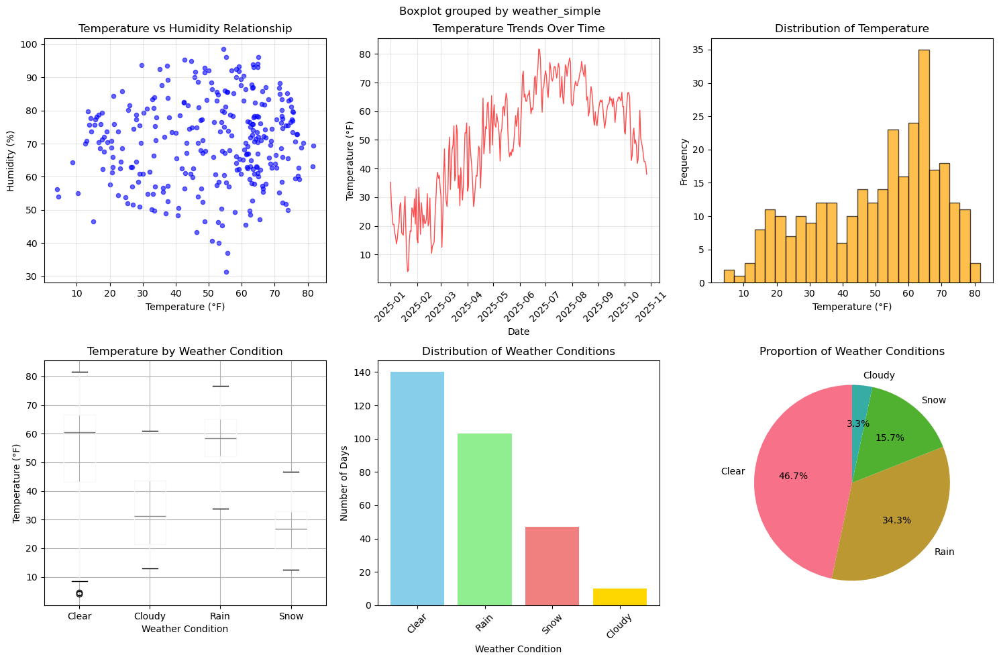
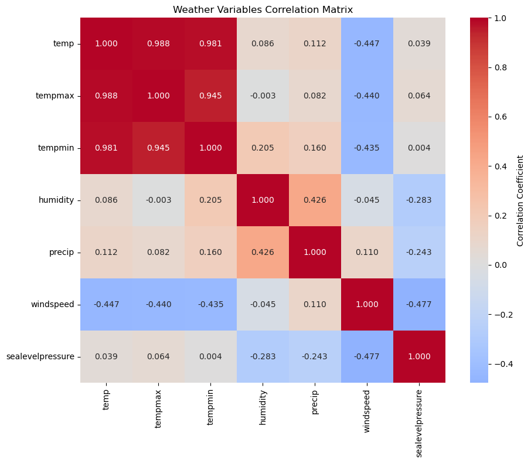

# Weather Data Analytics - Binghamton, NY

Analysis of real weather patterns in Binghamton, NY using statistical methods and data visualization techniques.

## Dataset Overview

**Location**: Binghamton, NY 
**Period**: January 1 - October 27, 2025  
**Records**: 300 daily weather observations  
**Variables**: 34 meteorological measurements including temperature, humidity, precipitation, wind, pressure, and weather conditions

## Analysis Results

### Temperature Patterns

The temperature data spans from 4.0°F to 81.7°F, with a mean of 50.4°F. Seasonal variation is pronounced across the year:

- Winter: 22.2°F (±8.0°F)
- Spring: 46.5°F (±11.5°F)  
- Summer: 68.4°F (±6.7°F)
- Fall: 56.7°F (±8.2°F)

### Notable Weather Events

Several extreme weather events were recorded in the dataset:

- Highest temperature: 81.7°F on June 23, 2025
- Lowest temperature: 4.0°F on January 21, 2025
- Greatest precipitation: 2.17 inches on July 13, 2025
- Highest wind speed: 25.0 mph on April 8, 2025

### Weather Condition Frequency

The most common weather conditions observed were:

1. Partially cloudy: 71 days (23.7%)
2. Rain with partial clouds: 70 days (23.3%)
3. Clear skies: 69 days (23.0%)
4. Rain with overcast: 26 days (8.7%)
5. Snow conditions: 42 days total (14.0%)

## Statistical Analysis

### Data Quality Assessment

The dataset demonstrates good overall quality:

- Completeness rate: 99.3% (272 missing values out of 10,200 total entries)
- Missing values are primarily in weather classification fields
- Extreme values have been preserved as they represent legitimate weather events

### Correlation Analysis

The analysis identified several important relationships between variables:

- Solar radiation and solar energy: 0.998 (very strong positive)
- Temperature and feels-like temperature: 0.998 (very strong positive)
- Minimum temperature and minimum feels-like: 0.996 (very strong positive)

These correlations reflect expected physical relationships and validate the data quality.

## Project Structure

```
data/
  42.0955,-75.9179.csv              # Binghamton weather dataset
notebooks/
  weather_analysis_lab.ipynb        # Complete analysis and visualizations
screenshots/                        # Visualization outputs
requirements.txt                    # Python dependencies
README.md                          # This document
```

## Methods and Approach

The analysis includes the following components:

1. Data loading and initial exploration of the weather dataset
2. Visualization of temperature trends, precipitation patterns, and weather conditions
3. Data preprocessing including missing value assessment and outlier evaluation
4. Statistical analysis including measures of central tendency and dispersion
5. Correlation analysis to identify relationships between meteorological variables

All analysis was performed using Python with pandas, numpy, matplotlib, and seaborn libraries.

## Analysis Outputs and Visualizations

### Comprehensive Data Visualization

The primary visualization suite displays multiple analytical perspectives on the weather data:



This figure contains six subplots showing:
- Temperature vs Humidity relationship (scatter plot)
- Temperature trends over the study period (line plot)
- Temperature distribution (histogram)
- Temperature variation by weather condition (box plot)
- Weather condition frequency distribution (bar chart)
- Proportion of weather conditions (pie chart)

### Correlation Analysis

The correlation matrix visualization identifies relationships between meteorological variables:



The heatmap reveals strong correlations between temperature variables and relationships between weather conditions and other meteorological factors. Notable findings include:
- Temperature, maximum temperature, and minimum temperature are highly correlated (r > 0.9)
- Wind speed shows negative correlation with atmospheric pressure
- Humidity and precipitation demonstrate moderate positive correlation

## Usage

1. **Activate Virtual Environment** (if needed):
   ```bash
   source .venv/bin/activate
   ```

2. **Start Jupyter Lab**:
   - Use VS Code's Task: "Start Jupyter Lab" (Cmd+Shift+P → "Tasks: Run Task")
   - Or run manually: `.venv/bin/python -m jupyter lab`

3. **Open the Analysis Notebook**:
   - Navigate to `notebooks/weather_analysis_lab.ipynb`
   - Your weather data is already configured and ready to use

4. **Run the Complete Analysis**:
   - Execute cells sequentially to perform the full analysis
   - All visualizations and statistics will be generated automatically


## Current Dataset

**File**: `data/42.0955,-75.9179.csv`  
**Location**: Binghamton, NY (coordinates: 42.0955,-75.9179)  
**Records**: 300+ daily weather observations  
**Variables**: Temperature, humidity, precipitation, wind, pressure, conditions, and more


---

**Course**: MSCS 634 - Data Analytics  
**Assignment**: Lab 1  
